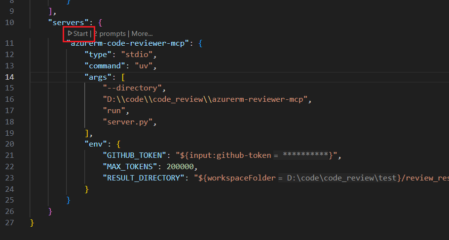
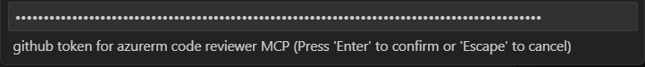
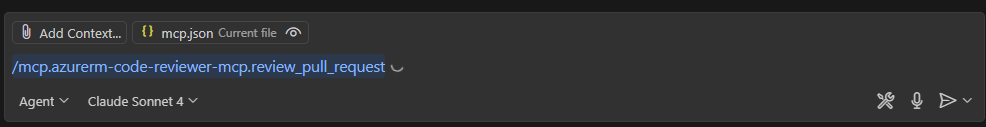
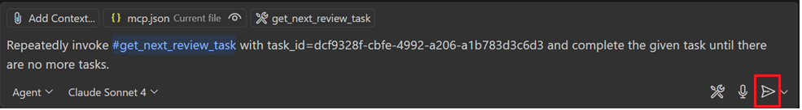
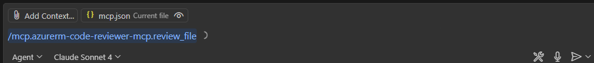
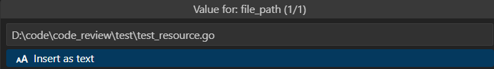
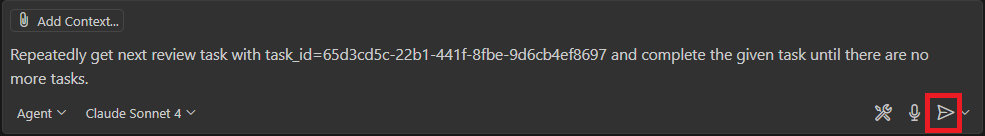

# Azure Resource Manager Reviewer MCP

An AI-powered code review assistant for [AzureRM Terraform Provider](https://github.com/hashicorp/terraform-provider-azurerm) using the [Model Context Protocol](https://modelcontextprotocol.io/introduction).

## Overview

This tool provides automated code review capabilities for new resources of [AzureRM Terraform Provider](https://github.com/hashicorp/terraform-provider-azurerm). It integrates with Visual Studio Code through the Model Context Protocol to analyze pull requests or local files for common issues and best practices based on the [AzureRM Provider Contributor Guides](https://github.com/hashicorp/terraform-provider-azurerm/tree/main/contributing).

## ⚠️ Important Limitations

- This is an **auxiliary tool** that supplements, but does not replace, manual code review
- This tool only reviews newly added files in a pull request
- May produce false positives or miss certain types of errors
- Should be used in conjunction with human review and testing

## Prerequisites

Before getting started, ensure you have the following installed:

1. **[Visual Studio Code](https://code.visualstudio.com/download)** - The primary development environment
2. **[UV Package Manager](https://modelcontextprotocol.io/quickstart/server#set-up-your-environment)** - For dependency management
3. **[GitHub Personal Access Token](https://docs.github.com/en/authentication/keeping-your-account-and-data-secure/managing-your-personal-access-tokens#creating-a-fine-grained-personal-access-token)** - For accessing GitHub repositories


## Installation and Setup

### 1. Clone the Repository

```bash
git clone https://github.com/ms-zhenhua/azurerm-reviewer-mcp
cd azurerm-reviewer-mcp
```

### 2. Enable MCP Support in VS Code

Follow the official documentation to [enable MCP support in VS Code](https://code.visualstudio.com/docs/copilot/chat/mcp-servers#_enable-mcp-support-in-vs-code).

### 3. Configure MCP Server

Create a `.vscode/mcp.json` file in your workspace following the [MCP server configuration guide](https://code.visualstudio.com/docs/copilot/chat/mcp-servers#_add-an-mcp-server-to-your-workspace).

#### Configuration Template

Use the template below and replace the placeholder values:

**File: `.vscode/mcp.json`**

> 📋 **Reference**: See [example configuration](./example/.vscode/mcp.json) for a complete example.

#### Configuration Parameters

| Parameter | Description |
|-----------|-------------|
| `<replace_with_your_absolute_path>` | The absolute path to your cloned `azurerm-reviewer-mcp` repository |
| `MAX_TOKENS` | Maximum token limit for the LLM (e.g., 200000) |
| `RESULT_DIRECTORY` | Directory path where review results will be stored. Make sure this directory can be accessed by both the MCP client and MCP server |
| `MAX_RULE_LENGTH_PER_PROMPT` | (Optional) Maximum character limit for rules included in each prompt (e.g., 10000). Smaller values improve LLM accuracy by reducing context complexity but require more prompt calls to process all rules. Defaults to half of the `MAX_TOKENS` value |
```json
{
    "inputs": [
        {
            "type": "promptString",
            "id": "github-token",
            "description": "GitHub token for azurerm code reviewer MCP",
            "password": true
        }
    ],
    "servers": {
        "azurerm-code-reviewer-mcp": {
            "type": "stdio",
            "command": "uv",
            "args": [
                "--directory",
                "<replace_with_your_absolute_path>/azurerm-reviewer-mcp",
                "run",
                "server.py"
            ],
            "env": {
                "GITHUB_TOKEN": "${input:github-token}",
                "MAX_TOKENS": "<replace_with_your_max_token>",
                "RESULT_DIRECTORY": "${workspaceFolder}/<replace_with_your_result_directory>"
            }
        }
    }
}
```

### 4. Start the MCP Server

1. Open `.vscode/mcp.json` in VS Code and start the azurerm-code-reviewer-mcp server

   

2. Enter your GitHub Personal Access Token when prompted

   

## Usage

The tool provides two main review capabilities:

### 🔍 Review Pull Requests

Analyze entire pull requests from GitHub repositories.

1. **Open Copilot Chat**: Type `/` in the copilot chatbox
2. **Select Command**: Choose `mcp.azurerm-code-reviewer-mcp.review_pull_request`

   

3. **Enter PR URL**: Input the GitHub pull request link

   

4. **Start Review**: Send the prompt to begin the automated review until the final result is generated in `review_result.md`.

   

### 📁 Review Local Files

Analyze individual files on your local system.

1. **Open Copilot Chat**: Type `/` in the copilot chatbox
2. **Select Command**: Choose `mcp.azurerm-code-reviewer-mcp.review_file`

   

3. **Enter File Path**: Input the absolute path to the file you want to review

   

4. **Start Review**: Send the prompt to begin the file analysis until the final result is generated in `review_result.md`.

   

## Contributing

We welcome contributions to improve the azurerm-reviewer-mcp tool. Please feel free to:

- Report issues
- Suggest new features
- Submit pull requests
- Improve documentation

## License

This project is licensed under the terms specified in the [LICENSE](./LICENSE) file.